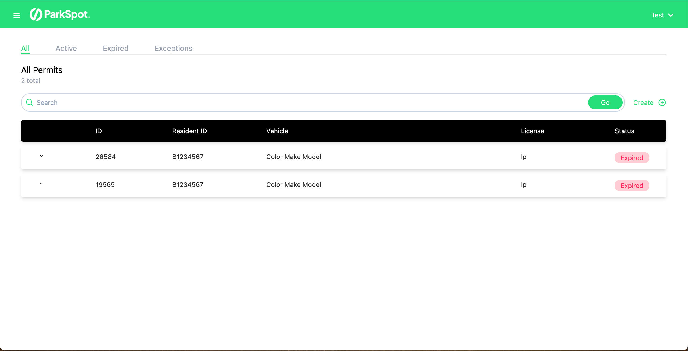
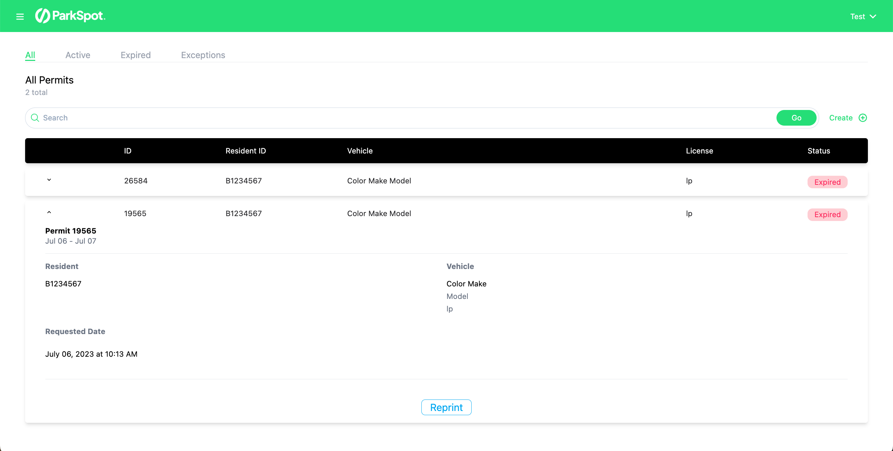
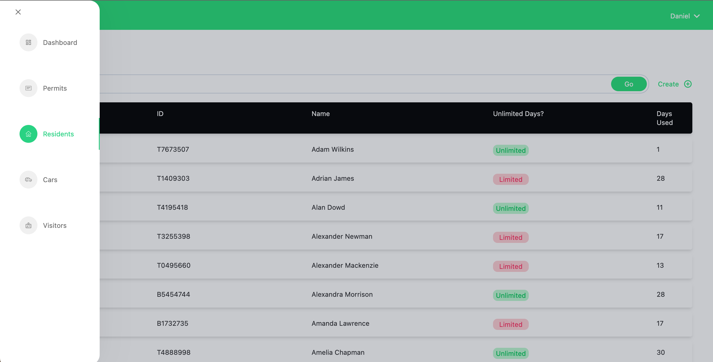

# Park Spot frontend

This is the frontend for the ParkSpot application. ParkSpot is a parking reservation and administration app that I developed for residential communities in Miami.

This service interfaces with a [backend service](https://github.com/dannyvelas/parkspot-backend) via HTTP.

## Framework
I chose Svelte for the frontend because it seemed to me to be the simplest and most elegant framework. It feels kind of like writing vanilla HTML+CSS+JS, except with tiny tweaks that give you the full power of a modern framework like React or Vue. Also, it has a [tiny build size](https://github.com/MarioVieilledent/js-framework-comparison), which I like. I believe it's faster on average than other frameworks, but I couldn't find any evidence to back this up.

If I had to choose a different framework, I might have chosen [SolidJS](https://www.solidjs.com/), which looks like a framework with the React syntax, but Svelte semantics.

## Navigation, Authentication and Authorization
The `/` path re-directs to `/login`. This login page is shared by all users of the application. The backend will detect the kind of user you are and log you in with the appropriate permissions.

You will start at the `/dashboard` page of your community. From there, you can use the side-bar to navigate to different pages like `/permits`, `/cars`, `/residents`, etc.
* You may not see some of these pages if you don't have permissions.
* If you manually type a path in the address bar, if you don't have access to that location, you will be re-directed to the home page.

## Screenshots

### Permits page (resident view)

### List items have expandable rows with options

### Navigation sidebar

## Setup
1. Clone [parkspot backend](https://github.com/dannyvelas/parkspot-backend)
2. Set it up
3. Create an `.env` file: `cp .env.example .env`
4. Install the dependencies: `npm install`
5. Run in development mode: `npm run dev`

## Local development
* All residents/admins in the sample data have the password: `notapassword`.
